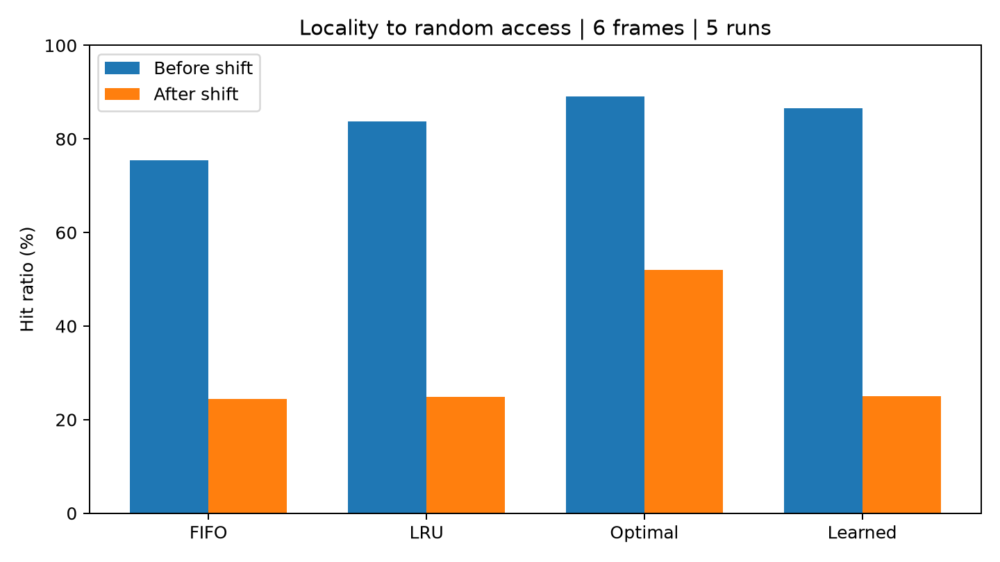
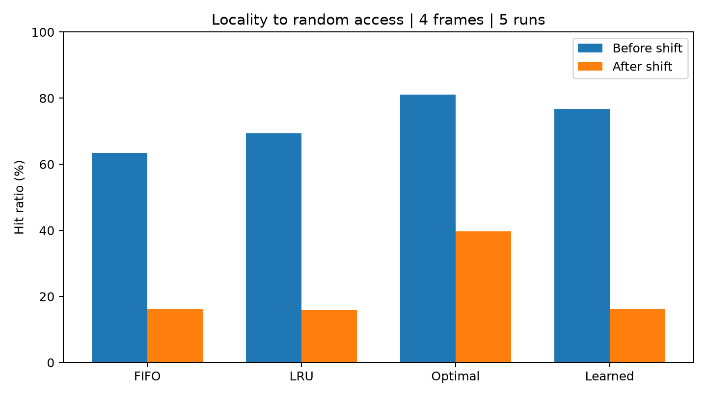

# Learned Page Replacement

CSE-307: Operating Systems — Section B  
Track 1: Learned Page Replacement

## About the project

This Python project compares FIFO, LRU, Optimal and a decision-tree page replacement policy. It measures hit ratios and page faults before and after a change in the page-access pattern.

The program is a simulation; it does not change the computer's actual memory.

## Setup and run

Python 3.10 or newer is required. Download the repository, extract it and open a terminal inside the folder containing main.py.

Install the required libraries:

```bash
python -m pip install -r requirements.txt
```

Run the experiment with six frames:

```bash
python main.py --frames 6
```

Run it with four frames:

```bash
python main.py --frames 4
```

Run the tests:

```bash
python test_policies.py
```

New results are saved in `Learned_Page_Results` inside the current user's home folder. The program prints the full location after running.

Each run replaces the output files in that folder. Copy the results somewhere else before running another configuration if you want to keep both.

## Page replacement policies

- **FIFO:** Removes the page that entered memory first.
- **LRU:** Removes the page that was used least recently.
- **Optimal:** Removes the page whose next use is farthest in the future. It is an offline reference because a real system cannot know future requests.
- **Learned:** Uses a decision tree to score the resident pages and select an eviction candidate. Equal scores are resolved using LRU.

## Learned component

The model uses two features for each resident page:

1. Number of requests since its last access.
2. Access frequency within the previous 50 requests.

Training labels come from Optimal's eviction decisions on eight separate training traces, using seeds 100–107. Future information is used to create training labels, but the learned policy uses only past accesses when making decisions.

The decision tree has a maximum depth of five and a minimum of 25 samples per leaf. The model stays fixed during evaluation; it is not retrained after the workload shift.

## Experimental setup

Each evaluation trace contains 2,000 requests over 24 possible pages.

- **First half:** 85% of requests target a small working set of four pages; the remaining requests follow a sequential scan.
- **Second half:** Requests become uniformly random across all 24 pages.

Evaluation uses five seeds: 42–46. Every policy receives the same traces, starts with empty memory and keeps its memory contents at the shift.

Two memory capacities were tested: four frames and six frames. The model is trained separately for each capacity.

Each phase contains 5,000 requests across the five evaluation runs.

## Results: six frames

| Policy | Before hit ratio | After hit ratio | Before faults | After faults |
|---|---:|---:|---:|---:|
| FIFO | 75.46% | 24.36% | 1,227 | 3,782 |
| LRU | 83.72% | 24.80% | 814 | 3,760 |
| Optimal | 89.02% | 52.06% | 549 | 2,397 |
| Learned | 86.58% | 25.04% | 671 | 3,748 |



## Results: four frames

| Policy | Before hit ratio | After hit ratio | Before faults | After faults |
|---|---:|---:|---:|---:|
| FIFO | 63.40% | 16.08% | 1,830 | 4,196 |
| LRU | 69.34% | 15.86% | 1,533 | 4,207 |
| Optimal | 81.12% | 39.70% | 944 | 3,015 |
| Learned | 76.80% | 16.26% | 1,160 | 4,187 |



## Discussion

In both configurations, the learned policy has a higher hit ratio than FIFO and LRU before the shift. After requests become random, its advantage becomes much smaller.

With six frames, the learned policy's hit ratio drops by 61.54 percentage points, the largest absolute drop among the four policies. With four frames, its drop is 60.54 percentage points, also the largest.

Random requests provide little useful information about future accesses. Online policies therefore achieve roughly 25% hits with six frames and roughly 16.67% with four frames. Optimal performs better because it knows future requests.

Reducing memory capacity increases total page faults for every policy in these experiments. Small differences between the online policies after the shift should not be treated as strong evidence of superiority.

These experiments cover one synthetic shift scenario and two memory capacities. They do not establish which policy is best for every workload.

## Files

- `main.py`: Workload generation, policies, model training and experiments.
- `test_policies.py`: Three tests covering a known reference trace, repeated accesses and Optimal's performance relative to FIFO and LRU.
- `requirements.txt`: Required Python libraries.
- `results/frames_4/`: Saved results for four frames.
- `results/frames_6/`: Saved results for six frames.

Each results folder contains:

- `hit_ratio.png`: Before/after comparison chart.
- `summary.csv`: Combined results across five runs.
- `per_run.csv`: Results for individual seeds.
- `results.txt`: Readable summary.
- `trace_*.csv`: Evaluation page-access traces.
- `steps_*.csv`: Per-step decisions for the first evaluation trace.

Hit ratio is calculated as hits divided by requests. Page faults are requests minus hits.

## AI assistance

ChatGPT assisted with the implementation, initial workload design, tests, documentation and interpretation of results. I ran the four-frame and six-frame experiments on my computer and ran the supplied tests; all three tests passed.

## Class demo

1. Explain page hits, page faults and eviction.
2. Show the FIFO, LRU and Optimal implementations.
3. Explain the decision tree's two features.
4. Run the program and show the results.
5. Discuss what changed after the workload shift.
